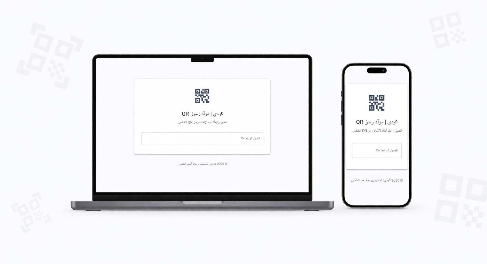

# 📱 QRCodi - Modern QR Code Generator

A fast, sleek, and modern QR code generator built with a focus on user experience and clean UI. 

🔗 **Live Demo:** [www.qrcodi.me](https://www.qrcodi.me/)

<p align="center">
  
</p>

## ✨ Features
* **Modern UI/UX:** Built with Material UI for a polished look.
* **Fully Responsive:** Works seamlessly on desktop and mobile.
* **RTL Support:** Perfectly aligned text and layouts for Arabic and other right-to-left languages.
* **Lightning Fast:** Powered by Next.js and optimized for speed.

## 🛠 Tech Stack
* **Framework:** [Next.js](https://nextjs.org/)
* **Language:** TypeScript
* **Styling & Components:** Material UI (MUI)
* **Deployment:** Vercel

## 🚀 Getting Started locally

To get a local copy up and running, follow these simple steps:

1. Clone the repo
   ```sh
   git clone https://github.com/AhmedAlmnsour/qrcodi.git
