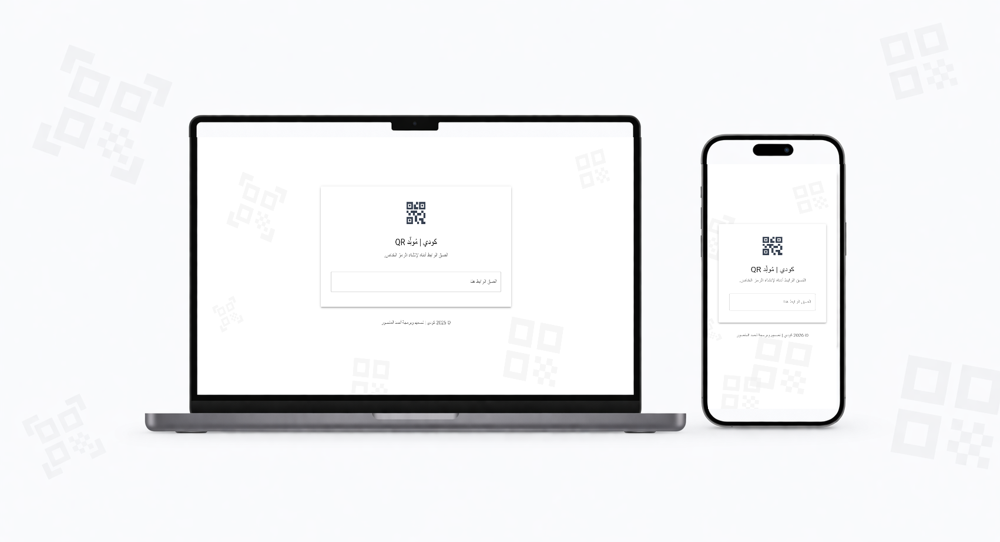

# كودي QR

مُولِّد رموز QR بواجهة عربية.




**[🔗 الموقع المباشر](https://www.qrcodi.me)** — **[موقع المطوّر](https://ahmed.almnsour.net)**

---

## الميزات

- واجهة عربية ودعم كامل للغة العربية (RTL).
- تصميم متجاوب على الحاسوب والجوال.
- تحميل الرمز كصورة PNG.
- بدون تتبّع، بدون إعلانات، بدون تسجيل.

## التقنيات

Next.js · TypeScript · Material UI · qrcode.react · Vercel

## التشغيل المحلّي

```bash
git clone https://github.com/ahmedalmnsour/qrcodi.git
cd qrcodi
npm install
npm run dev
```

افتح [http://localhost:3000](http://localhost:3000) في المتصفّح.

## الترخيص

[MIT](./LICENSE)

---

# Codi QR

An Arabic-first QR code generator.

## Features

- Arabic-first UI with full RTL support
- Responsive on desktop and mobile
- Download as PNG
- No tracking, no ads, no sign-up

## Stack

Next.js · TypeScript · Material UI · qrcode.react · Vercel

## Run Locally

```bash
git clone https://github.com/ahmedalmnsour/qrcodi.git
cd qrcodi
npm install
npm run dev
```

Open [http://localhost:3000](http://localhost:3000) in your browser.

## License

[MIT](./LICENSE)
