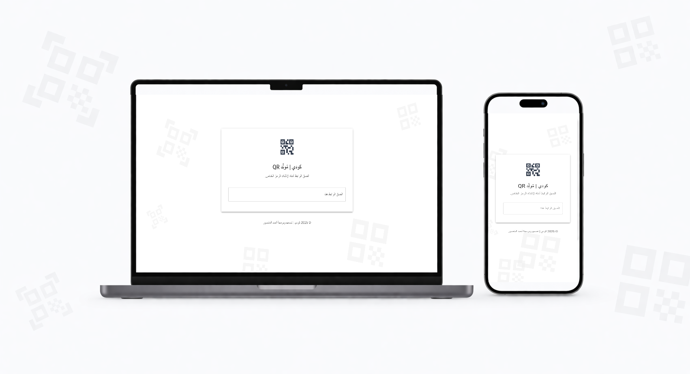

# كودي

أداة عربية صغيرة لتوليد رموز QR، بُنيت بإتقان.




**[🔗 الموقع المباشر](https://www.qrcodi.me)** — **[موقع المطوّر](https://ahmed.almnsour.net)**

---

## الميزات

- واجهة عربية ودعم كامل للغة العربية (RTL).
- تصميم متجاوب على الحاسوب والجوال.
- تحميل الرمز كصورة PNG.
- بدون تتبّع، بدون إعلانات، بدون تسجيل.


## التشغيل المحلّي

```bash
git clone https://github.com/ahmedalmnsour/qrcodi.git
cd qrcodi
npm install
npm run dev
```

افتح [http://localhost:3000](http://localhost:3000) في المتصفّح.

---

**English:** QRCodi — an Arabic-first QR code generator. [Live demo](https://qrcodi.me)

---

## الترخيص

[MIT](./LICENSE)
